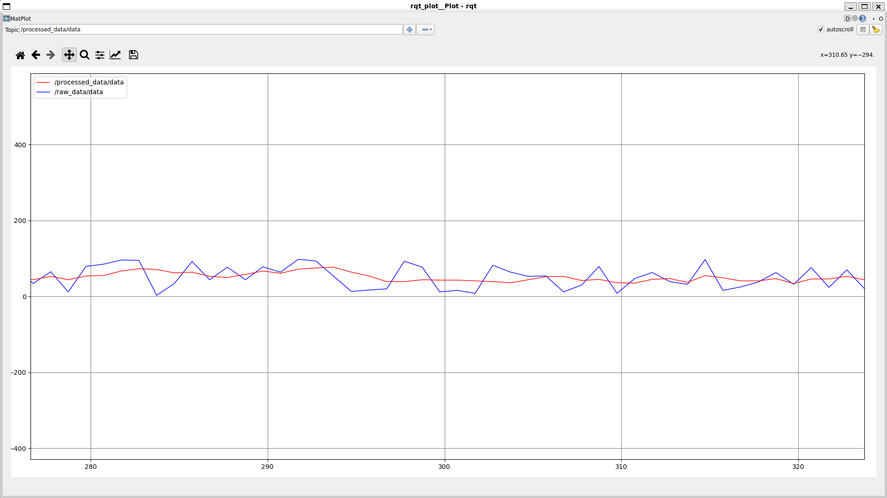

# 🚀 ROS2 Smart Data Processing Pipeline

## 📌 Overview
This project implements a modular ROS2-based data processing pipeline using a publisher–subscriber architecture.

It simulates a real-world robotics system where sensor data is generated, processed, and monitored in real time.

---

## 🧠 Architecture
Sensor Node → Processor Node → Alert Node


- **Sensor Node**: Generates random data (simulated sensor)
- **Processor Node**: Applies moving average filtering (signal smoothing)
- **Alert Node**: Triggers warnings based on configurable thresholds

---

## ⚙️ Features

- Real-time data streaming using ROS2 topics
- Moving average filter for noise reduction
- Parameterized alert system (`threshold`)
- Launch file for running full system
- Live visualization using `rqt_plot`

---

## 📡 Topics

| Topic | Description |
|------|------------|
| `/raw_data` | Raw sensor values |
| `/processed_data` | Smoothed output values |

---

## 📊 Visualization

The system behavior can be visualized using:

```bash
ros2 run rqt_plot rqt_plot 


Plot:

/raw_data/data
/processed_data/data
```
--- 

## ▶️ How to Run
```bash
cd ~/ros2_ws
colcon build --symlink-install
source install/setup.bash

ros2 launch smart_pipeline pipeline.launch.py
``` 
## ⚙️ Parameter Configuration

You can modify the alert threshold at runtime:

ros2 run smart_pipeline alert --ros-args -p threshold:=80

🧪 Example Output
Sensor: 45
Raw: 45 | Smoothed: 40
⚠ ALERT! High value: 130

🧰 Tech Stack
- ROS2 (Jazzy)
- Python (rclpy)
- rqt_plot (visualization)

## 📸 Screenshot



🚀 Future Improvements
- Custom ROS2 message types
- Integration with real sensor data
- Visualization in RViz
- Deployment on physical robot

## 👨‍💻 Author

Tannishth Gupta